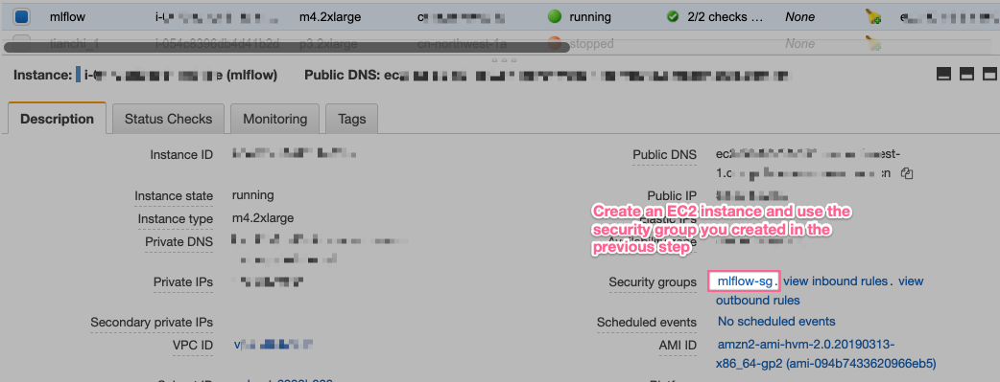
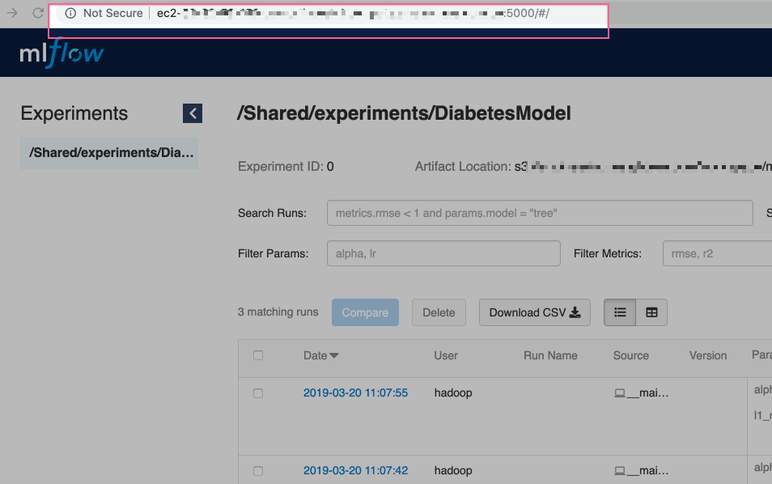

# MLflow Quick Start: Training and Logging

This is a Quick Start demo based on [Databrick's MLflow tutorial](https://docs.databricks.com/_static/notebooks/mlflow/mlflow-quick-start-training.html). In this tutorial, we’ll:

* Install the MLflow server on a EC2 instance
* Create an jupyter kernel for MLflow using anaconda
* Create a notebook with that kenel to train a diabetes progression model and log metrics, parameters, models, and a .png plot from the training to the MLflow tracking server
* View the training results in the MLflow experiment UI

## 1. Install MLflow on EC2

### 1.1 Create a security group

You should craete a security group and open port 5000 for your IP. 


### 1.2 Create an EC2 instance



### 1.3 Install MLflow
SSH into the ec2 instance and run the following commands

```
# install mlflow
pip install mlflow

# create mlflow file store folder
mkdir mlflow_file_store

# create a screen
screen -dmS mlflow
screen -r mlflow

# start mlflow tracking server
mlflow server \
--file-store /home/ec2-user/mlflow_file_store \
--default-artifact-root s3://YOUR_S3_BUCKET/workspace/mlflow_disk/artifact-root/ \
--host 0.0.0.0

```

Note:
1. I run the mlflow tracking server in a screen called `mlflow` so that the server will keep running even after I close the ssh session. This is just for demo purpose and is not recommened if you are planning to run the mlflow tracking server in production.

2. I use a s3 bucket for the `--default-artifact-root` in this example, but you can use local folder as well. You can read more about MLflow storage [here](https://www.mlflow.org/docs/latest/tracking.html#storage)

### 1.4 Run mlflow as service
Create script to start the mlflow service 
```
#!/bin/sh
if [ $1 = 'start' ]
then
    mlflow server --file-store /home/ec2-user/mlflow_file_store --default-artifact-root s3://YOUR_BUCKET_HERE/workspace/mlflow_disk/artifact-root/ --host 0.0.0.0
fi  
```
Add mlflow.service as a systemctl service.
Create a new file /usr/lib/systemd/system/mlflow.service
```
[Unit]
Description=mlflow service

[Service]
Type=simple
ExecStart=/home/ec2-user/mlflowService.sh start

[Install]
WantedBy=mutil-user.target
```
Start mlflow service
```
sudo  systemctl start mlflow.service
```
check status 
```
sudo  systemctl status mlflow.service
```
### 1.5 Back upthe mlflow file store folder periodically
Create script to upload file to S3 bucket
```
#!/bin/bash
# backup mlflow file and upload to s3

MLFILE_DIR='/home/ec2-user/mlflow_file_store/'
S3_DIR='s3://YOUR_BUCKET_HERE/workspace/mlflow_disk/file-store/'
LOG='/home/ec2-user/bakup/upload.log'
set -x
daytime=$(date "+%Y%m%d")
bakfile=/home/ec2-user/bakup/"mlflow"$daytime".tar"
tar -czvf $bakfile  $MLFILE_DIR
echo $(date +%Y-%m-%d,%H:%m:%s) >> $LOG
echo 'create bakfile '$bakfile >> $LOG
aws s3 cp $bakfile $S3_DIR
echo 'upload s3 succeed' >> $LOG
set +x
```
Add a crontab record to run the script once a day
```
00 02 * * * /home/ec2-user/upload2s3.sh
```

## 2. Create a mlflow virtuanl environment

Now let's go ahead and create a conda environment for mlflow. (You can download Anaconda from [here](https://www.anaconda.com/distribution/))

```
conda create -n mlflow_test python=3.6 ipykernel
source activate mlflow_test
pip install mlflow
pip install scikit-learn
pip install matplotlib
```

## 3. Training and Logging

Once the env has been created, you should be able to see the new kernel in your jupyter


Next step, import the [mlflow_test.ipynb](mlflow_test.ipynb) to your jupyter and change the mlflow tracking server url in the notebook.


You're all set to run all the cells in the notebook at this stage and you should be able to review the experiment in the mlflow tracking server(`http://EC2-PUBLIC-DNS:5000/`) by openning the experiment `/Shared/experiments/DiabetesModel` in the workspace.




